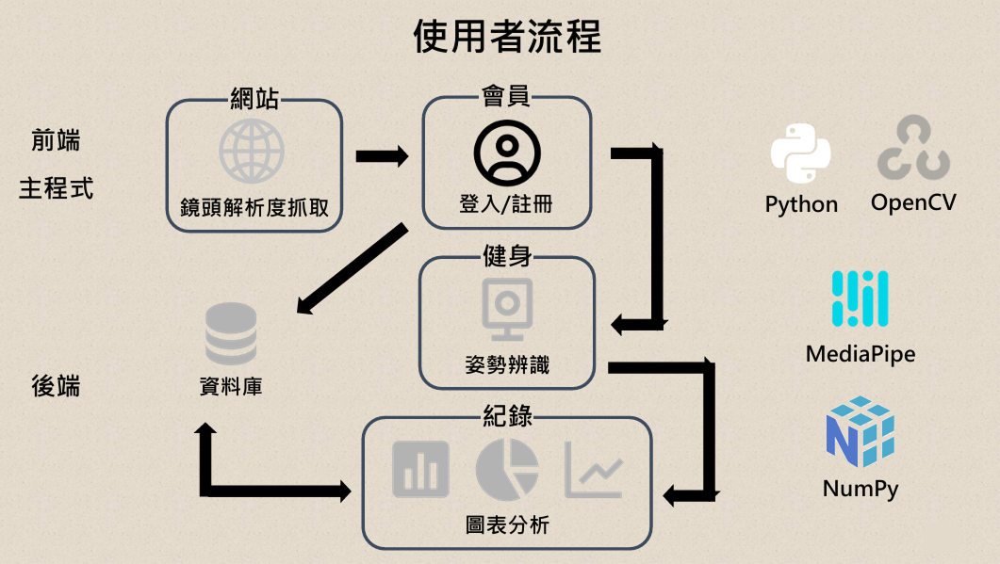
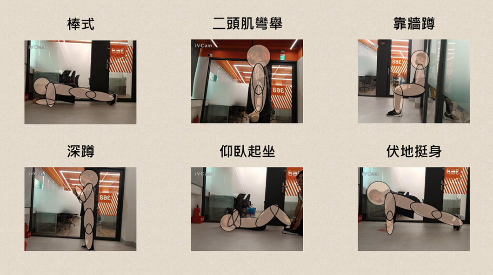
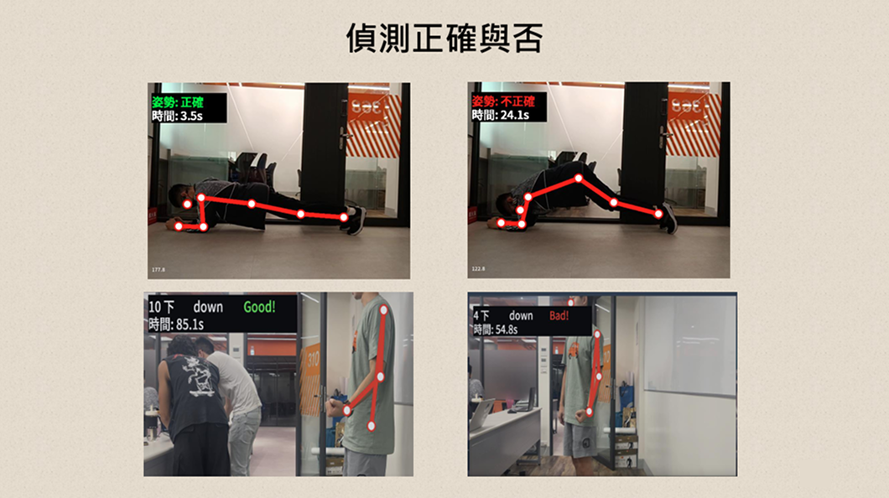
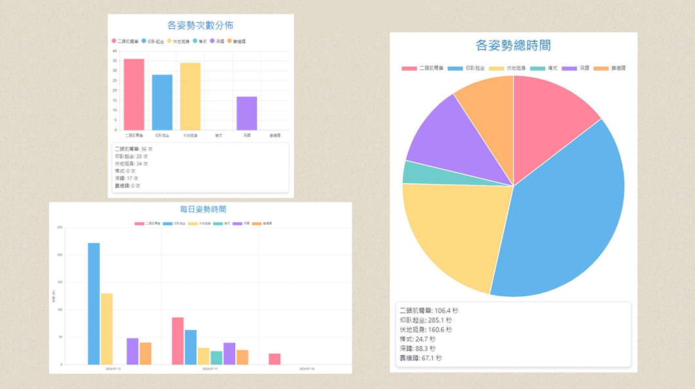

# 居家健身助理網站

> [!warning]
> 此專案程式碼已無法在現代環境直接執行。

本專案是一個以健身姿勢偵測為主題的輕量化網頁。專案透過 Flask 建立後端路由與會員系統，使用 OpenCV、MediaPipe Pose 與 Pillow 處理網路攝影機影像，並將使用者的運動紀錄存入 SQLite 資料庫。

<p align="center">
  
</p>

<br>

## 專案主題與主要功能

- 使用者登入後可進入健身訓練頁面，選擇不同運動項目

<p align="center">
  
</p>

- 連動手機鏡頭即時擷取影像，並以 MediaPipe Pose 偵測人體關鍵點，針對不同動作進行姿勢判斷與計數

<p align="center">
  
</p>

- 儲存使用者運動紀錄(運動種類、運動時間、姿勢狀態與次數)，提供運動紀錄頁面彙整各運動項目的次數與累積時間

<p align="center">
  
</p>

<br>

## 使用到的開發技術與套件

### Backend

- Python：主要後端語言。
- Flask：Web framework，用於 route、template rendering 與 API response。
- Flask-SQLAlchemy：在 `main.py` 中用於讀取 `records.db` 的 `Record` model。
- SQLite：本機資料庫，用於儲存使用者與運動紀錄。
- Werkzeug security utilities：處理雜湊密碼與驗證。

### Computer Vision

- OpenCV (`opencv-python`)：讀取 webcam、設定解析度、影像編碼與獨立視窗測試。
- MediaPipe (`mediapipe`)：使用 Pose solution 偵測人體姿勢關鍵點。
- NumPy：角度計算與影像 alpha channel 處理。
- Pillow：在 camera frame 上繪製文字、合成姿勢提示圖。

### Frontend

- HTML / CSS
- JavaScript
- Jinja templates：Flask 使用的伺服器端模板。

### 其他資源

- `articles.json`：運動教學內容與圖片、影片連結資料。

## 專案架構

```text
/
├─ main.py        # Flask app 入口，註冊 blueprint、設定 database、定義首頁與紀錄頁
├─ auth.py        # 使用者註冊、登入、登出與 login*required decorator
├─ home.py        # 主要頁面、運動頁面、webcam 啟停、video stream 與紀錄寫入
├─ workout.py     # 各運動項目的即時姿勢偵測與影像串流產生器
├─ posecheck.py   # 姿勢角度與動作正確性判斷
├─ poseready.py   # 姿勢準備階段與人體骨架繪製
├─ funs.py        # 影像處理、解析度偵測、角度計算等 helper functions
├─ myclass.py     # SQLAlchemy Record model 與姿勢名稱轉換 helper
├─ dbfuns.py      # sqlite3 database connection 與 schema 初始化
├─ schema.sql     # user / records table schema
├─ articles.json  # 運動教學資料
├─ static/        # CSS、JavaScript 與運動圖片資源
└─ templates/     # Flask Jinja templates html
```

## 專案使用流程

1. 註冊帳號或登入既有帳號
2. 進入 workout page，選擇運動項目
3. 頁面會連動手機鏡頭進行姿勢偵測與即時畫面串流

   > p.s. 若要直接使用電腦/筆電 webcam，須將 `home.py` 的 `cam_number` 設置成 `0`

4. 停止運動後，系統會將紀錄寫入 database
5. 可到 data / result page 查看運動紀錄統計
